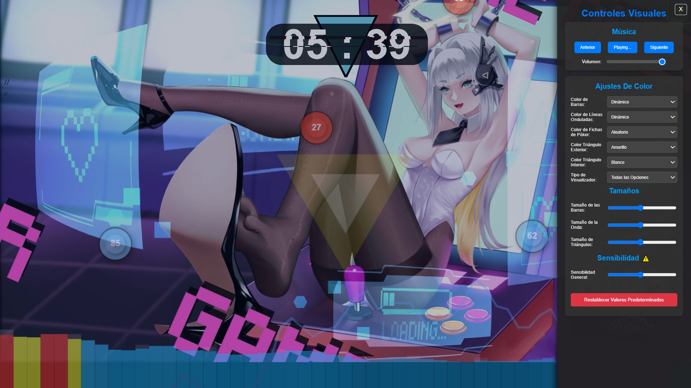

# Extensión de Visualización de Audio para Nueva Pestaña

Esta extensión de Chrome reemplaza la página de nueva pestaña predeterminada con un visualizador de audio interactivo y un reproductor de música integrado. Personaliza la apariencia de la visualización, controla la reproducción de tu música local y disfruta de una experiencia de nueva pestaña inmersiva.

## Características Principales

- --Visualizaciones de Audio Dinámicas:-- Elige entre varios tipos de visualización:
    - --Barras:-- Clásicas barras de frecuencia que responden al ritmo de la música.
    - --Ondas:-- Líneas ondulantes que fluyen con el sonido.
    - --Fichas de Póquer:-- Fichas animadas que rebotan y responden al volumen.
    - --Triángulos:-- Formas triangulares que pulsan al compás.
- --Reproductor de Música Integrado:--
    - Controles de reproducción básicos: Play/Pause, Anterior, Siguiente.
    - Lista de reproducción predefinida (editable en el código).
    - Control de volumen.
- --Personalización de la Visualización:--
    - Selección de color para barras, ondas y fichas de póquer.
    - Ajuste de la intensidad general de la visualización.
    - Ajustes de intensidad individuales para barras y ondas.
    - Control del tamaño de los triángulos.
    - Selección de color para los triángulos internos y externos.
    - Selección de múltiples tipos de visualización para mostrar simultáneamente.
- --Persistencia de la Configuración:-- La extensión guarda tus preferencias (volumen, colores, tipo de visualización, última canción reproducida) para que se mantengan al abrir nuevas pestañas.
- --Diseño Adaptable:-- La visualización se adapta al tamaño de la ventana del navegador.
- --Botón de Restablecimiento:-- Permite volver a la configuración predeterminada fácilmente.
- --Panel de Controles Deslizante:-- Un panel lateral que se puede abrir y cerrar para acceder a todas las opciones de personalización sin obstruir la visualización principal.

## Instalación

1.  Descarga o clona este repositorio en tu computadora.
2.  Abre Google Chrome y ve a `chrome://extensions/`.
3.  Activa la opción "Modo de desarrollador" en la esquina superior derecha.
4.  Haz clic en el botón "Cargar desempaquetada" en la esquina superior izquierda.
5.  Selecciona la carpeta de la extensión que descargaste o clonaste.

La extensión ahora estará instalada y activada. Al abrir una nueva pestaña, verás el visualizador de audio.

## Uso

1.  --Reproducción de Música:-- La extensión incluye una lista de reproducción predefinida en el archivo `index.html` (en la misma carpeta que este README). Para reproducir estas canciones, simplemente haz clic en el botón "Play". Puedes modificar la `playlist` en el código JavaScript (`index.html`) para incluir tus propios archivos de audio (asegúrate de que las rutas sean correctas). Los archivos de audio deben estar ubicados dentro de la carpeta de la extensión o ser accesibles mediante URLs.
2.  --Control de Reproducción:-- Utiliza los botones "Anterior", "Siguiente" y el control deslizante de volumen en la parte inferior de la pantalla.
3.  --Personalización de la Visualización:--
    - Haz clic en el botón de "Abrir Controles" (generalmente un icono de ajustes o un botón similar) para abrir el panel de controles deslizante en el lado izquierdo de la pantalla.
    - Utiliza los selectores de color (`barColorSelect`, `waveLineColorSelect`, `pokerChipColorSelect`, `innerTriangleColorSelect`, `outerTriangleColorSelect`) para cambiar los colores de los diferentes elementos visuales. Las opciones "dynamic" o "random" proporcionarán variaciones basadas en el audio.
    - Utiliza los controles deslizantes (`intensitySlider`, `barIntensitySlider`, `waveIntensitySlider`, `triangleSizeSlider`) para ajustar la intensidad y el tamaño de las visualizaciones.
    - Utiliza el selector de tipo de visualización (`visualizerTypeSelect`) para elegir qué visualizaciones mostrar. Puedes seleccionar múltiples opciones. La opción "all" mostrará todas las visualizaciones disponibles.
    - Haz clic en el botón de "Cerrar Controles" para ocultar el panel de personalización.
4.  --Restablecer Configuración:-- Si deseas volver a la configuración predeterminada, haz clic en el botón "Restablecer Defaults" dentro del panel de controles.

## Notas

- Esta extensión utiliza la Web Audio API para analizar el audio y generar las visualizaciones.
- La lista de reproducción actual está codificada directamente en el archivo `script.js`. Para una funcionalidad más avanzada, se podría implementar una forma de cargar listas de reproducción o integrar con APIs de música.
- El rendimiento puede variar dependiendo de la complejidad de la visualización y la potencia de la computadora.

## Créditos
Codigo
- [J-Aca]

Musica. 
- [Eru Nabura](https://x.com/EruNabura)

Arte de Fondo. 
-[Ragus](https://x.com/Ragus_art/)
-[sourse](https://x.com/Ragus_art/status/1749093504578449778)

## Licencia MIT
